# How to Build the Home Assistant Smart Home System with Docker

Home Assistant (HA) is an open-source smart home system built on Python, offering integration with various devices and highly customizable configurations. With Home Assistant, you can easily connect smart devices from different brands (such as cameras, fans, air conditioners) and leverage automation, group management, and UI customization features to create a personalized smart space. Additionally, HA supports Siri control, allowing users to manage home devices effortlessly through voice commands.
As open-source software, Home Assistant is available for free and is compatible with thousands of devices and services, enabling you to build a unified, intelligently connected home management system.

## Deploy Container Using Docker Compose

To quickly deploy Home Assistant on UGREEN NAS, it is recommended to use Docker Compose for project management. This method is suitable when you need to create and manage multiple containers, making containerized management convenient. The following detailed steps will guide you how to deploy Home Assistant using Docker Compose. [How to Use Docker Compose on UGREEN UGOS Pro?](https://support.ugnas.com/knowledgecenter/#/detail/eyJpZCI6MzMyLCJ0eXBlIjoidGFnMDAxIiwicGF0aENvZGUiOiJwcm8wMDIsOWpvcDV3LGUyZVNueiIsImxhbmd1YWdlIjoiZW4tVVMiLCJjbGllbnRUeXBlIjoiUEMiLCJhcnRpY2xlVmVyc2lvbiI6IiJ9)

### 1. Access the Docker Project Interface

In the UGOS Pro system of UGREEN NAS, open the "Docker" app, click "Project > Create" to start the project creation wizard.

### 2. Configure the Docker Compose File

In the wizard, you'll need to provide a Docker Compose configuration file. Below is the example configuration file for Home Assistant: 
```docker
services:
    homeassistant:
        container_name: homeassistant  # Container name
        image: homeassistant/home-assistant:latest  # Container image version
        restart: always                # Container restart policy
        network_mode: host             # Container network mode
        volumes:
            - ./homeassistant:/config  # Mount directory for configuration files storage
        environment:
            - TZ=Asia/Shanghai         # Timezone setting
```
::: details
- Use the  directive to enable shared storage between the NAS main unit and the container. `./homeassistant:/config` represents the directory where the Docker Compose file is located, and the homeassistant folder in this directory will be mapped to the  directory in the container. All configuration files and databases for Home Assistant will be stored in this directory.
- Assign the name homeassistant to the Docker container to facilitate direct management by container name.
- Specify the Home Assistant Docker image to use. The `latest` tag ensures that the most recent version is pulled.
- Set the container’s restart policy to always. This ensures the container restarts automatically, regardless of whether it stopped normally or unexpectedly.
- Configure the container's network mode as host, allowing the container to use the NAS host’s network interface directly, simplifying communication with external smart devices.
- Use the environment variable  to set the container's time zone. This is essential for maintaining consistent timestamps for automated tasks and logs. You can adjust the time zone to match your location (e.g., `America/Chicago` or `Europe/Berlin`).
:::

### 3. Deploy the Project

After confirming that the configuration file is correct, click "Deploy Now". The system will automatically pull the image and start the container. Once the deployment is complete, you can access the Home Assistant console by visiting `your-nas-name.local:8123` in your browser.


## Access the Home Assistant Console

After the deployment is complete, open the browser and enter the NAS IP address or name and port (e.g., `192.168.0.65:8123` or `your-nas-name.local:8123`) to access the console. Click “Create My Smart Home” and follow the setup wizard to complete the configuration.

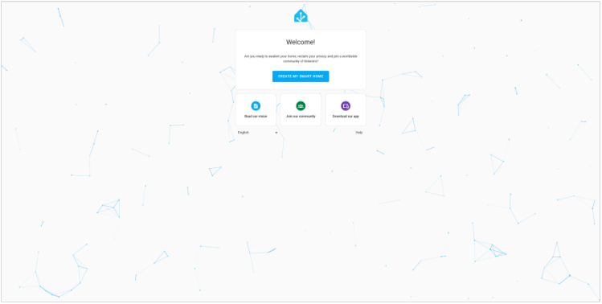

Follow the prompts to enter your name, username, and password to create your Home Assistant account.

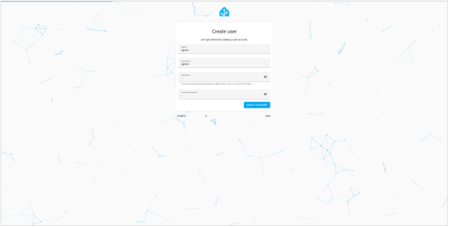

You can set your home’s location based on your actual needs, or click “Skip” to proceed.

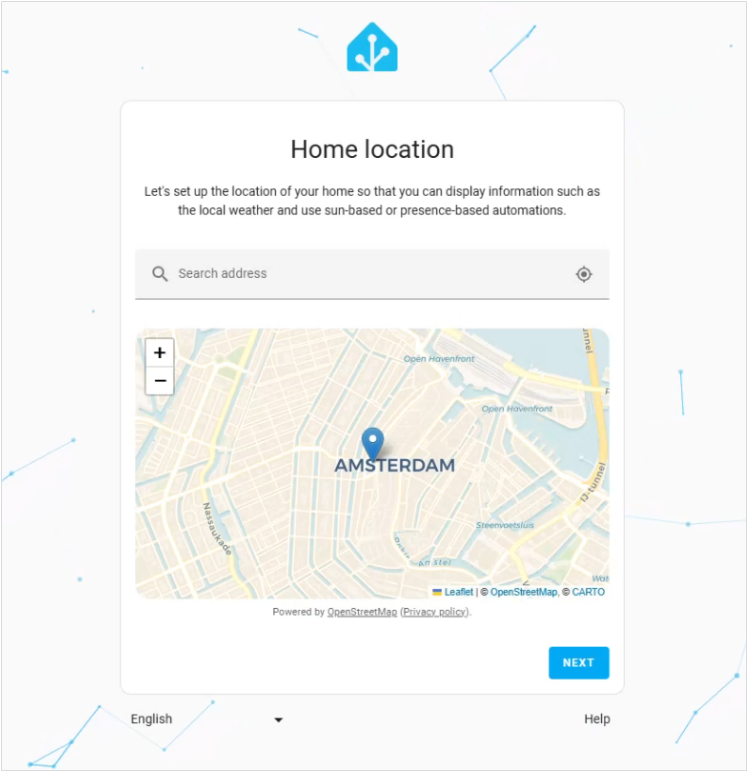

Choose whether to send analytics or not, and which ones, then click "Next" to continue. If you don't want to send any analytics, you can disable every option and click "Next" to continue.

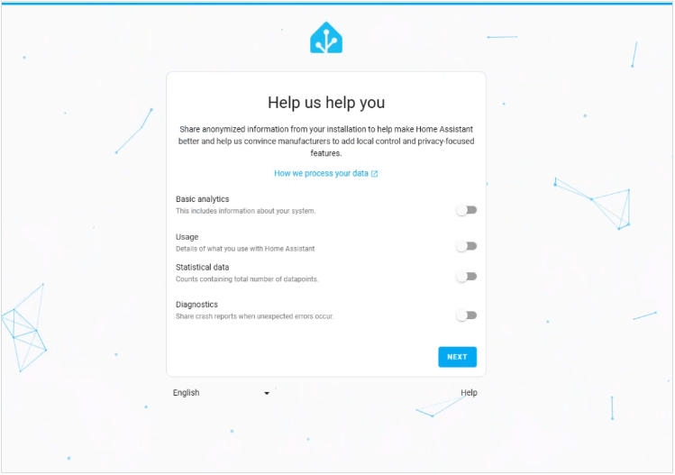

Click "Finish" to access the Home Assistant home page. You can add devices, configure automation rules, and customize the dashboard here.

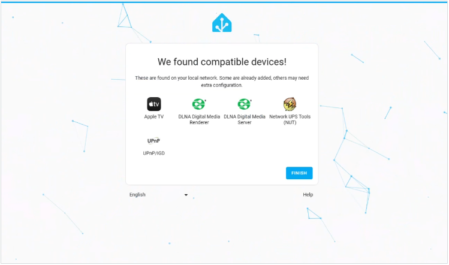

If you need to change the language, you can adjust the system language to one you are familiar with in "User Settings".

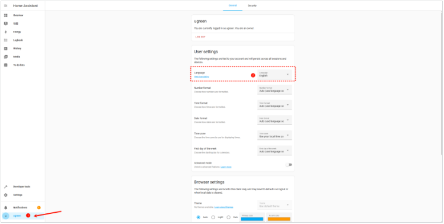

## Install the HACS Plugin Store

HACS (Home Assistant Community Store) is a community-driven plugin store of Home Assistant, allowing users to install various integrations and plugins. Follow these steps to install HACS:

1.	Open the file manager, create `www` and `custom_components` folders under the `Shared Folder/docker/homeassistant` directory. If the fo. Note: is the plugin directory.

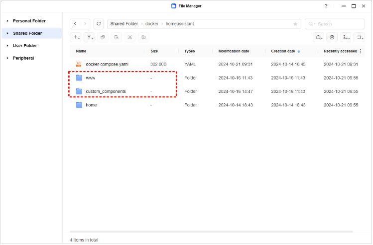

2.	Go to GitHub to download the latest version of the HACS archive. If you don't have a GitHub account, you can register one first and then proceed with the download. https://github.com/hacs/integration/releases

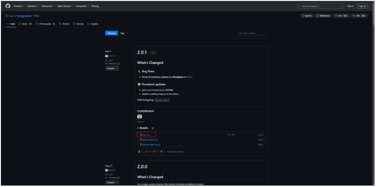

3.	After downloading, extract the hacs.zip archive and upload the extracted files to the `Shared Folder/docker/homeassistant/custom_components` directory. All the files should be in the `hacs` directory.


4.	Restart the Home Assistant container through the Docker application or by using the Developer Tools on the Home Assistant page.

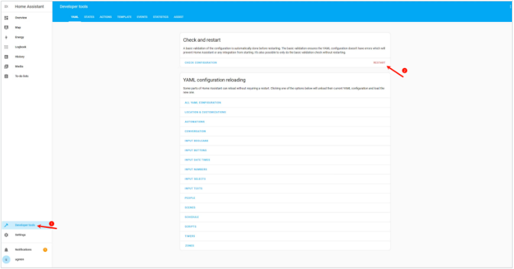

5.	After the restart, go to the Home Assistant page, click Settings > Devices & Services, select Add Integration, search for and add HACS.


6.	Check all the options and click "Submit".

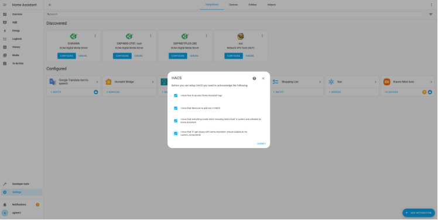

7.	Copy the code, then click the GitHub link on the page to proceed with account binding. If you don't have a GitHub account, you can register one yourself and follow the prompts to complete the account binding process.

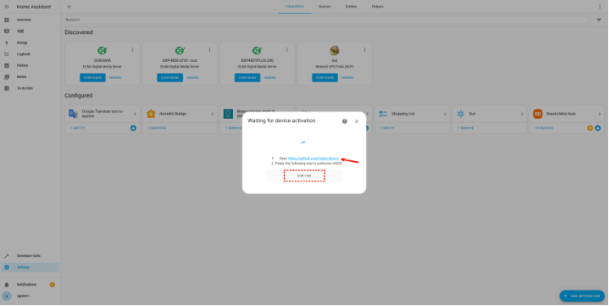

8.	After entering the code, click "Continue".


9.	Click "Authorize hacs". The screen will indicate that the authorization was successful.


10.	After completing the binding, you will see the HACS option in the sidebar of Home Assistant.

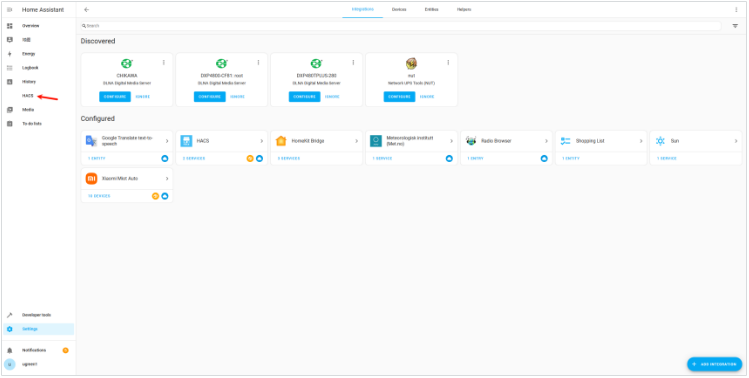

Congrats ! You installed Home Assistant ! :tada:

::: info Credit
This guide was created by Ugreen and modified by [Topiga](https://github.com/topiga/)
:::