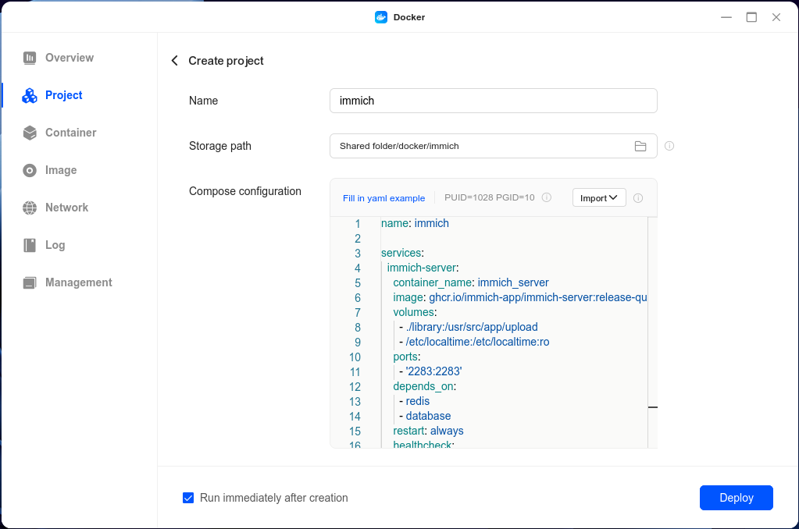

# How to install Immich

Immich is a **self-hosted** photo and video management solution that allows users to back up, organize, and manage their media on their **own** servers, offering enhanced **privacy** and **control** over personal data. It is designed for **high performance**, capable of handling **large media libraries** efficiently. Key features include **automatic backups** from **mobile devices**, **multi-user** support, **advanced search** functionality using tags and EXIF data, **image tagging**, **object detection**, and **geolocation** mapping. Immich's user-friendly mobile app and web interface make it **easy to upload and view** media, while its active community ensures ongoing development and support. This makes Immich a robust, privacy-focused alternative to third-party cloud services for managing extensive photo and video collections.

## Deploy Container Using Docker Compose

To quickly deploy Immich on UGREEN NAS, it is **recommended** to use Docker Compose for project management. This method is suitable when you need to create and manage multiple containers, making containerized management convenient. The following detailed steps will guide you how to deploy Home Assistant using Docker Compose. [How to Use Docker Compose on UGREEN UGOS Pro?](https://support.ugnas.com/knowledgecenter/#/detail/eyJpZCI6MzMyLCJ0eXBlIjoidGFnMDAxIiwicGF0aENvZGUiOiJwcm8wMDIsOWpvcDV3LGUyZVNueiIsImxhbmd1YWdlIjoiZW4tVVMiLCJjbGllbnRUeXBlIjoiUEMiLCJhcnRpY2xlVmVyc2lvbiI6IiJ9)

### 1. Access the Docker Project Interface

In the UGOS Pro system of UGREEN NAS, open the "Docker" app, click "Project > Create" to start the project creation wizard.

### 2. Configure the Docker Compose File

In the wizard, you'll need to provide a Docker Compose configuration file. The docker compose file for immich can be found [here](https://raw.githubusercontent.com/UGREEN-NASync/community-guide/refs/heads/main/docs/ugos/install/immich/compose.yaml). 

::: details
- Specify the Immich Docker image to use. The `latest` tag ensures that the most recent version is pulled.
- For `immich-machine-learning`, the `-openvino` makes sure the image uses the intel machine learning capabilities.
- Use the environment variable  to set the container's time zone. This is essential for maintaining consistent timestamps for automated tasks and logs. You can adjust the time zone to match your location (e.g., `America/Chicago` or `Europe/Berlin`).
:::

### 3. Deploy the Project

After confirming that the configuration file is correct, click "Deploy Now". The system will automatically pull the image and start the container. Once the deployment is complete, you can access the Home Assistant console by visiting `your-nas-name.local:2283` in your browser.

## Access the Immich Web Interface

After the deployment is complete, open the browser and enter the NAS IP address or name and port (e.g., `192.168.0.188:2283` or `your-nas-name.local:2283`) to access the interface. Click “Getting Started” and follow the setup wizard to complete the configuration.

You should see a registration page for the first user (and admin) of your Immich server. Use your real email and a strong password.

After registering, you should see a login page. Use the email address you used to create the first account, and the password you set earlier.
Options will present to you to be configured. Leave everything as default.

That's it ! You now have a working Immich instance on your machine, congrats ! :tada:

## Adding more users

To add more users to your Immich instance, you may go on the top-right corner and click on "Administration"

You should see a page with all the users on Immich. You can create a new user using the button "Create user".
You should see a popup to set up an email, password, name, and quota. We advise you to make sure the toggle "Require user to change password at first login" is checked.
Click on "Create" to create it.

## Add hardware transcoding

For better speed and efficiency, you can enable hardware video transcoding. You can click on [this link](https://my.immich.app/admin/system-settings?isOpen=video-transcoding+hardware-acceleration), put the address of your immich instance (e.g., `http://192.168.0.188:2283` or `http://your-nas-name.local:2283`), and scroll down to "Hardware Acceleration". It should be open.

::: details Alternative
You can also click on the top-right corner and click on "Administration", then click on "Settings" on the left sidebar, then scroll to "Video Transcoding Settings" and expand this section, to then expand "Hardware Acceleration"
:::

Now, you can select "Quicksync" as the Acceleration API, and save your changes on the "Save" button at the end on the web page.
You now have hardware transcoding enabled ! :tada:

## Configure the external domain

If you configured Immich to be accessed outside, via a reverse proxy or a tunnel, you may add the address to your instance. On the administration settings pages, you may find a "Server Settings", or click on [this link](https://my.immich.app/admin/system-settings?isOpen=server)
By expanding this section, you may put your external url, with `http://` or `https://`, depending on your configuration.

This part is really important to add [email support](#adding-email-notifications).

## Adding email notifications

To add email notifications, if you have an external domain, you must first [configure the external domain](#configure-the-external-domain).
After that, you may begin.

First, you need to have an email provider that allows you to send emails via an [SMTP server](https://aws.amazon.com/what-is/smtp/).

::: details
There's a [reddit thread](https://www.reddit.com/r/homelab/comments/1hre8nn/which_email_provider_has_simple_smtp_support/) for email providers with smtp support for a homelab. You could also use your own email, with gmail, outlook, or a lot of other email hosting services.
:::

After that, you need to go in "Notification Settings", on the administration settings pages, or click on [this link](https://my.immich.app/admin/system-settings?isOpen=notifications+email)

You may now enter the smtp settings of your provider.

### Gmail
To configure Immich for Gmail, you will need these information:
- SMTP server: `smtp.gmail.com`
- Port: `587` (Recommended - TLS) or `465` (SSL)
- Username: `your-email-address@gmail.com`
- Password: [an app password]()
- Ignore certificate errors : Unchecked
- From address : `Immich Photo Server <your-email-address@gmail.com>`

### Outlook
::: info
If you want to use your email in Immich from Outlook, you'll first need to enable access. On Outlook:
1. Select Settings -> Mail -> [Forwarding and IMAP](https://go.microsoft.com/fwlink/?linkid=875424).
2. Under **POP** and **IMAP**, toggle the slider for **Let devices and apps use POP** or **Let devices and apps use IMAP** to **ON** depending on the account you are enabling.
3. Select **Save**.
:::

To configure Outlook for Immich, you will need these information.
- SMTP server: `smtp-mail.outlook.com`
- Port: `587`
- Username: `your-email-address@outlook.com`
- Password: Your Microsoft account password. If your password is not being recognized, you may need [an app password](https://support.microsoft.com/en-us/account-billing/how-to-get-and-use-app-passwords-5896ed9b-4263-e681-128a-a6f2979a7944).
- Ignore certificate errors : Unchecked
- From address : `Immich Photo Server <your-email-address@outlook.com>`

::: info Credit
This guide was created by [Topiga](https://github.com/topiga/). Consider buying an [Immich licence](https://immich.app/blog/2024/immich-licensing/) to support their great work!
:::
